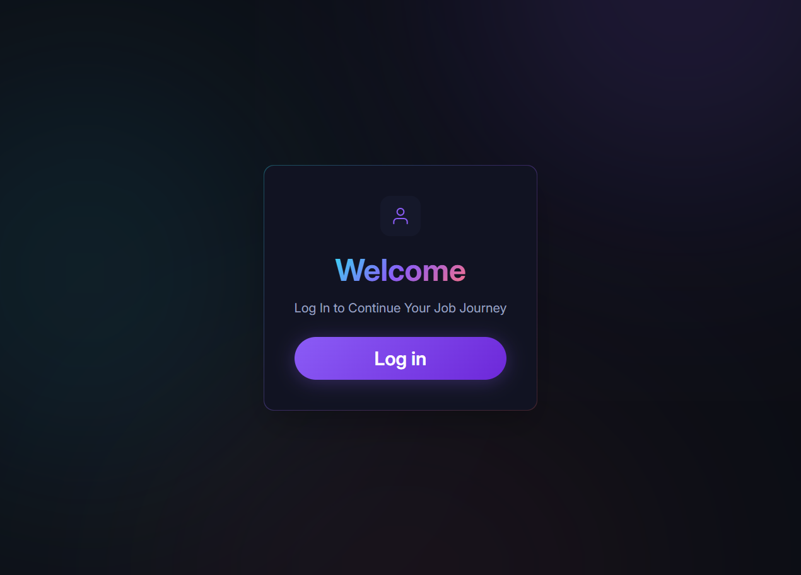
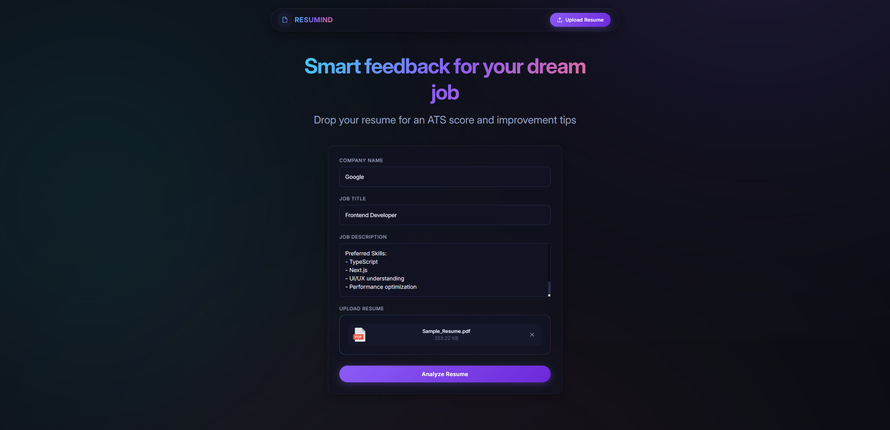
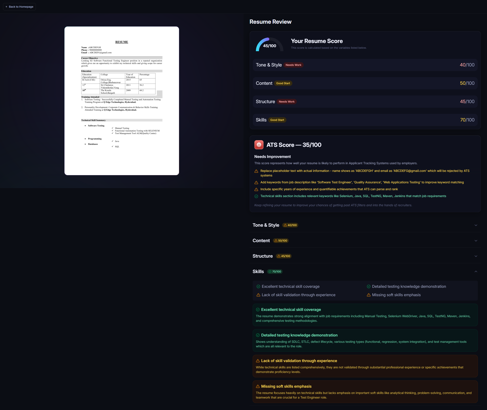

# Resumind – AI Resume Analyzer

A modern, production-ready web application that analyzes resumes against job descriptions using AI, providing an ATS score, detailed feedback, and actionable improvement tips.

Built with a premium dark-mode UI featuring glassmorphism, fluid animations, and a responsive layout.

<p align="center">
  
  
</p>
<p align="center">
  
  
</p>

## Features

-  **PDF Resume Upload**: Secure drag-and-drop resume uploading.
- 🤖 **AI-Powered Analysis**: Instant feedback powered by the Puter.js AI API.
- 🎯 **ATS Scoring**: Calculates an Applicant Tracking System compatibility score based on the target job description.
-  **Actionable Tips**: Detailed breakdowns on experience, skills, and formatting.
- 🎨 **Premium UI/UX**: Custom dark theme with glassmorphism, vibrant accent gradients, and micro-animations.
- ⚡️ **React Router + Tailwind CSS**: Fast, modern, and fully responsive frontend.

## Tech Stack

- **Framework**: React Router v7
- **Styling**: Tailwind CSS v4, custom CSS with glassmorphism utility classes
- **Backend/Services**: Puter.js (Authentication, File Storage, AI inference, Key-Value Store)
- **Utilities**: `pdfjs-dist` (PDF to Image conversion)

## Getting Started

Follow these steps to run the project locally on your machine.

### Prerequisites

Ensure you have the following installed:
- [Node.js](https://nodejs.org/) (v18 or higher recommended)
- `npm` (comes with Node.js)

### 1. Clone the Repository

```bash
git clone https://github.com/appasabkambale/ai-resume-analyzer.git
cd ai-resume-analyzer
```

### 2. Install Dependencies

Install the required packages using npm:

```bash
npm install
```

### 3. Start the Development Server

Start the local development server:

```bash
npm run dev
```

Your application will be up and running at `http://localhost:5173` (or the next available port). 

### 4. Authentication & Usage

1. Open `http://localhost:5173` in your browser.
2. Click **Log In** to authenticate via Puter.com (handles auth seamlessly).
3. Navigate to the **Upload Resume** page.
4. Enter the target Company Name, Job Title, and paste the Job Description.
5. Upload your Resume (PDF format).
6. Click **Analyze Resume** and wait for the AI to generate your detailed feedback report!

## Folder Structure

```text
├── app/
│   ├── components/    # Reusable UI components (Navbar, ScoreGauge, etc.)
│   ├── routes/        # Page routes (home, auth, upload, resume)
│   ├── lib/           # Utility functions and Puter store configuration
│   ├── root.tsx       # Root application layout
│   └── app.css        # Global styles and Tailwind configuration
├── public/            # Static assets (images, SVGs)
├── constants/         # Application constants and AI prompt instructions
└── ...
```

---

Built with ❤️ using React Router and Puter.js.
